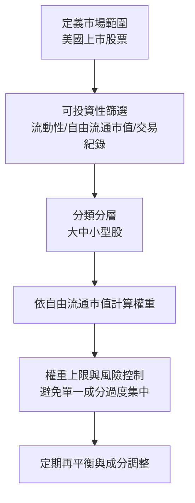

# 被動投資入門到進階：以 VOO / VTI 為主

## 1) 先講結論

- 你如果只想要一句話版本：`長期、低成本、分散、規律投入`。
- `VOO` 與 `VTI` 都是美股核心被動投資工具，差異主要在覆蓋範圍：
  - `VOO`: S&P 500（美國大型股為主）
  - `VTI`: 美國全市場（大中小微型股）

## 2) 被動投資的基本理論

### 2.1 市場很難長期被打敗

主動選股要持續打敗市場，需要同時做到：

- 更好的資訊
- 更快的決策
- 更低的交易成本與稅負
- 長期紀律不失誤

對多數人而言，這四件事同時成立的機率不高，所以「先拿市場平均報酬」是務實策略。

### 2.2 成本是可控且影響巨大的變數

長期終值可寫成：

$$
W_T = W_0 \prod_{t=1}^{T}(1+r_t-c_t)
$$

- $r_t$：市場報酬
- $c_t$：總成本（管理費、交易成本、稅負、滑價）

被動投資核心是壓低 $c_t$，讓複利更多留在自己口袋。

## 3) VOO vs VTI：怎麼選

| 面向 | VOO | VTI |
|---|---|---|
| 追蹤標的 | S&P 500 | CRSP US Total Market Index |
| 涵蓋公司數 | 約 500 | 約 3,000~4,000 |
| 風格偏向 | 大型股 | 全市場 |
| 中小型股曝險 | 較少 | 較多 |
| 共同特徵 | 低費率、高流動性、適合長期持有 | 低費率、高流動性、適合長期持有 |

實務上：

- 想簡單且聚焦美國核心大型企業：`VOO`
- 想一次包下整個美股市場：`VTI`

## 4) Market Cap Index（市值加權指數）怎麼編排

市值加權概念：

$$
w_i=\frac{P_i \cdot N_i}{\sum_{j=1}^{n} P_j \cdot N_j}
$$

- $P_i$：第 $i$ 檔股票價格
- $N_i$：流通在外股數（實務常用 free-float 調整）
- $w_i$：指數權重

### 4.1 指數編製常見流程

### 4.2 市值加權的特性

- 優點：
  - 低換手、低交易成本
  - 容易容量化（可容納大資金）
  - 自然貼近「市場組合」
- 缺點：
  - 贏家權重愈來愈大，可能產生集中風險
  - 小型股權重低，因子曝險有限

## 5) 從理論到落地執行

### 5.1 簡化版投資流程

1. 訂目標：例如 10 年以上資產成長。
2. 選核心 ETF：`VOO` 或 `VTI`（可再搭配債券）。
3. 設投入規則：定期定額（DCA），例如每月固定投入。
4. 設再平衡規則：例如每年一次，或偏離目標權重超過 5% 時。
5. 例外處理：大跌時照規則，不憑情緒加碼/停扣。

### 5.2 一個最小可行配置（MVP）

- 成長型：100% `VTI`（或 `VOO`）
- 穩健型：80% `VTI` + 20% 債券 ETF
- 保守型：60% `VTI` + 40% 債券 ETF

## 6) 進階數學：為什麼「市場組合」合理

### 6.1 均值變異數框架（Markowitz）

給定報酬向量 $\mu$ 與共變異數矩陣 $\Sigma$，投資組合權重為 $w$：

$$
\max_w \quad w^\top \mu - \frac{\lambda}{2} w^\top \Sigma w
$$

當市場足夠有效、交易摩擦低、參與者分散時，市值加權組合常被視為一個可行近似解。

### 6.2 CAPM 的直觀連結

CAPM 核心式：

$$
E[R_i]-R_f=\beta_i\big(E[R_m]-R_f\big)
$$

- $R_m$ 可對應「市場投資組合」
- 被動 ETF 的概念，就是以極低成本貼近 $R_m$

### 6.3 對數效用與長期成長率

若目標是長期成長，常看期望對數報酬：

$$
g = E[\ln(1+R_p)]
$$

高費率或高換手會侵蝕 $R_p$，讓 $g$ 長期下降。這也是低成本被動策略能長跑的數學原因。

### 6.4 追蹤誤差（Tracking Error）

ETF 與指數差距可用：

$$
TE=\sqrt{\mathrm{Var}(R_{ETF}-R_{Index})}
$$

被動策略重點不是「每一天都一樣」，而是長期維持低 `TE` 與低成本。

## 7) 風險你要知道

- 股市系統性風險：`VOO/VTI` 仍會跟市場一起回撤。
- 集中風險：市值加權可能在特定產業過重。
- 行為風險：最大敵人通常是投資人自己（追高殺低、策略漂移）。

## 8) 實務檢查清單

- 是否有明確投入規則（日期/金額/標的）？
- 是否知道自己可承受最大回撤？
- 是否有再平衡規則，而非靠感覺？
- 是否控制了費用、稅負與交易頻率？

如果以上都能做到，`VOO` 或 `VTI` 已足夠作為多數人的核心長期方案。
